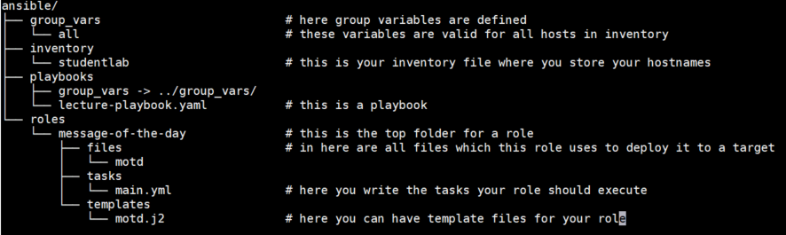
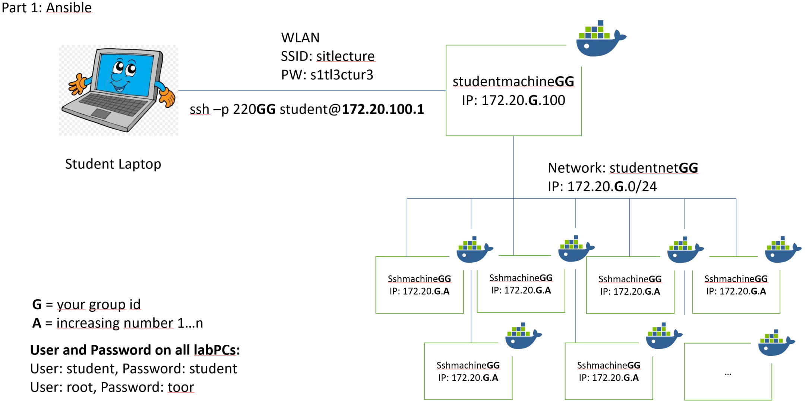
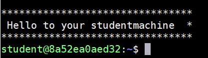
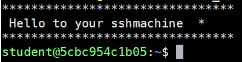
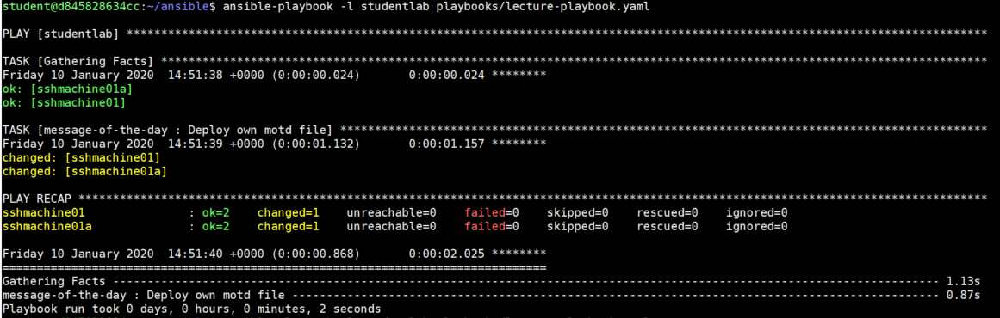
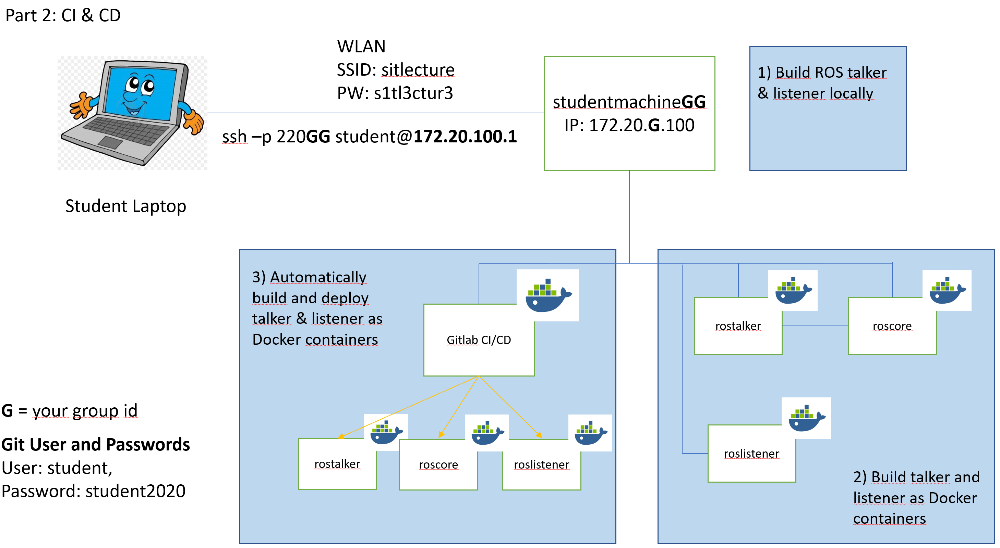

# Workshop Handout Lecture „Config Management & Continuous Delivery"

## Requirements:
Laptop with SSH Client, e.g. Putty or MobaXTerm. You can get them free
here:

Putty: <https://www.chiark.greenend.org.uk/~sgtatham/putty/latest.html>

or
MobaXTerm: <https://mobaxterm.mobatek.net/download-home-edition.html>

For this lecture you are in group: GG__

## Part 1 - Ansible
### Scenario
You are IT Admin in a company, and you are tasked to setup and configure
multiple new PCs in an autonomous driving vehicle. Until now, you always
configured your servers manually by hand, but this would mean to do the
same thing on multiple machines. Thus, you decided to use the config
management tool Ansible to deploy the configurations to all PCs
simultaneously.

In the following tasks, you will:

-   See if your PCs are up & running & reachable in the network

-   Make them known and reachable to Ansible

-   Use Ansible to configure a message-of-the-day on all PCs with just
    one playbook

From you Ansible Tutorial, you know that Ansible requires the following
file structure:

### Lecture Lab Network Layout - Part 1 Ansible

### Task 1: Connect to your group studentmachine via ssh and try to ping your "sshmachine"
SSH command to access your studentmachine:

    ssh -p 220***GG*** student@172.20.100.1

You should see something similar to this:

T1.1: Ping your corresponding sshmachines.

    ping sshmachine0101
    ping sshmachine0102

### Task 2: Ansible ping
Enter the directory "/home/student/ansible".

Here you can find a basic Ansible directory structure. Look a bit around
to see what's here.

T2.1: Update the inventory file "studentlab", with your
"sshmachine**GGAA"** hosts in the inventory group **"studentlab"**

Try the following ansible ping command to validate that Ansible can reach and access each of your sshmachine.

    ansible -m ping <hostname>

T2.2: Now try to use your inventory group name to reach your whole group "studentlab" from your inventory.

    ansible --m ping --i <inventory> <inventory_group>

### Task 3: Deploy "message of the day"
T3.1: Ssh into your sshmachine**GG** and look at the prompt how you are
greeted. You should see something like this:

After you saw it, **log out** to be in your studentmachine again.

T3.2: Read and understand what a Linux "Message of the Day (MOTD) is:\
<https://linuxconfig.org/how-to-set-a-custom-message-of-the-day-on-linux>

T3.3: Now you want to create your own motd file and **deploy** it to all
your Ansible targets (all sshmachinesGGAA).

Create a folder for a role "message-of-the-day" with subfolders "files"
and "tasks".

Create a file with name "motd" under "roles/message-of-the-day/files/"
with the following content:

    *****************************************  
    * sshmachine: group <YOUR GROUP Number> *    
    *****************************************  

T3.4: Now create a file "/roles/message-of-the-day/tasks/main.yml", where
you use the Ansible module **copy** to deploy your motd file to your
sshmachines to the folder "/etc/motd".

Ansible copy module:
<https://docs.ansible.com/ansible/latest/modules/copy_module.html>

T3.5: Write a simple Ansible playbook "lecture-playbook.yaml", which
executes your role "message-of-the-day" to your ssh machine. Use the
already prepared example file under ansible/playbook as a help.

Run your ansible playbook to deploy your motd file to your sshmachines:

    ansible-playbook -i studentlab playbooks/lecture-playbook.yaml

Watch the output, it should look like this:

SSH into your sshmachines and check if your deployment worked.

T3.3. Run your playbook again and look at the Ansible output. Notice,
that it should not change the "/etc/motd" file, since it is still correct.
Congrats, you reached a reproducible target state!

## Part 2 -- CI / CD
### Lecture Lab Network Layout - Part 2 CI / CD

### Scenario

Google hired you as an SRE (Site-Reliability Engineer). You are supposed
to set up a Continuous Delivery pipeline for a set of distributed
applications (talker, listener and middleware) such that the development
team can make changes and deliver them to the customer in a more
efficient way. You plan to get developer, tester and operations people
together and first figure out how they build, test and deploy their
applications now. Then you start automating things based on Docker and
GitLab CI.

### Task 4: Manually checkout, build and run applications
1. checkout git repository

    mkdir workspace && cd workspace
    git clone http://172.17.0.1:8080/root/ad_software.git src

2. source environment and run build commands

    source /opt/ros/melodic/setup.bash
    catkin_make talker
    catkin_make listener

3. run it

    source devel/setup.bash
    rosrun talker talker

4. kill it

    CTRL + c

### Task 5: Automate the build

Now we want start automating above steps using Docker. There are two
Dockerfiles that we need to adapt for that (add build commands)

1.  add build command for talker application in src/talker/Dockerfile

2.  cd src/talker && sudo docker build --t talker_**GG**:latest .

3.  add build command for talker application in src/listener/Dockerfile

4.  cd src/listener && sudo docker build --t listener_**GG**:latest .

### Task 6: Automate deployment

To prepare deployment of your applications, we want to implement a
docker-compose.yml file that describes how our applications inside
docker will be executed.

1.  Rename the services described in workspace/src/docker-compose.yml to
    make them unique (see ToDo in docker-compose.yml)

2.  Use your build docker images (e.g. talker_**GG**:latest) in
    docker-compose.yml

3.  Check if applications start properly

4.  **sudo** docker-compose up

### Task 7: Implement Continuous Integration (CI)

1.  Create a feature branch for your team, add, commit and push changes
    made in the previous tasks:\
    a) git checkout -b feature/team-**GG**
    b) git add *
    c) git commit -m "my commit message"
    d) git push --set-upstream origin feature/team-**GG**

2.  Add docker build commands from Task 5 to .gitlab-ci.yml file

3.  Commit and push change of .gitlab-ci.yaml file

### Task 8: Implement Continuous Delivery (CD)

1.  Add docker-compose command from Task 6 to .gitlab-ci.yml file

2.  Commit and push change of .gitlab-ci.yml file

3.  Verify your pipeline builds properly and runs your services\
    a. sudo docker ps | grep -e core -e _GG
